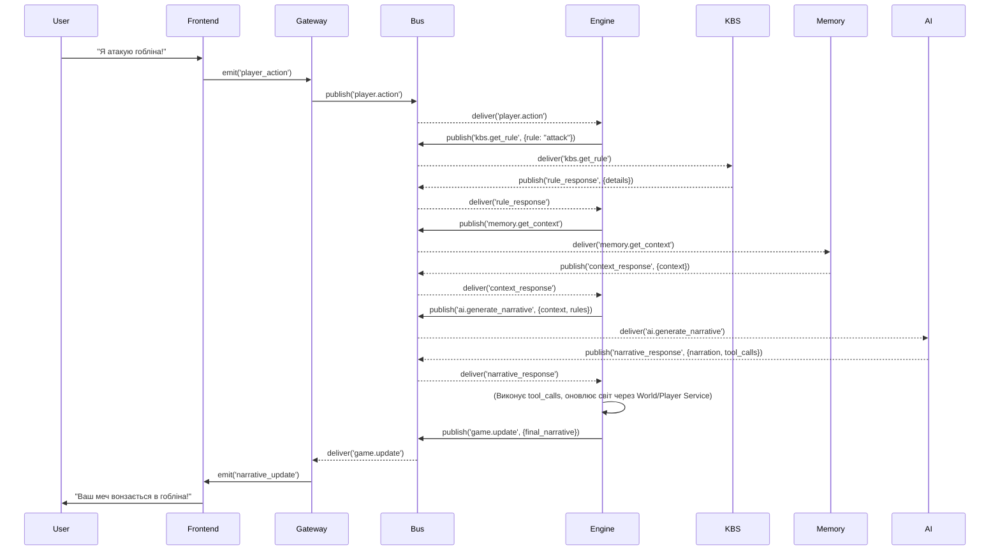

# 2. Огляд Архітектури

Система є набором незалежних мікросервісів, що асинхронно взаємодіють через центральну шину подій (RabbitMQ). Це виключає прямі залежності та "спагетті-код".

### Високорівнева Схема

```
"Клієнтська частина"
    Frontend[React App]
        ^
        | HTTP/WebSocket
        v
"Backend Інфраструктура"
    Gateway[API Gateway / WebSocket] <--> Bus[RabbitMQ]

"Ігрові Сервіси" (Всі підключені до RabbitMQ)
    - Engine[Game Engine]
    - World[World Service]
    - Player[Player Service]
    - AI[AI Narrative Service]
    - Memory[Memory Service]
    - KBS[Knowledge Base Service]

"Бази Даних"
    - SQLite (Player, World, Short-Term Memory)
    - ChromaDB (Vector Memory, Knowledge Base)
```

### Детальний Опис Компонентів

*   **API Gateway (`api-gateway`):** Єдина точка входу для клієнтів. Керує WebSocket-з'єднаннями, автентифікує користувачів і публікує їхні дії в шину подій.
*   **RabbitMQ (`rabbitmq`):** Центральна шина подій. Забезпечує асинхронну комунікацію між усіма сервісами за принципом "публікація-підписка".
*   **Game Engine (`game-engine`):** Оркестратор ігрового процесу. Не містить бізнес-логіки, а координує запити до інших сервісів у правильній послідовності.
*   **Player Service (`player-service`):** Керує даними гравців та їхніх персонажів (профілі, інвентар, характеристики).
*   **World Service (`world-service`):** Керує станом ігрового світу (локації, NPC, ігровий час).
*   **AI Narrative Service (`ai-narrative`):** Мозок ШІ. Генерує описи, діалоги та сюжетні повороти, використовуючи LLM (OpenAI/Anthropic). Повертає відповідь у строго структурованому JSON.
*   **Memory Service (`memory-service`):** Вирішує проблему "амнезії" ШІ. Зберігає короткострокову пам'ять (останні події в SQLite) і довгострокову (стислі резюме в ChromaDB).
*   **Knowledge Base Service (`kbs`):** Сховище "істинних" знань: правила гри, лор світу, кастомні механіки. Надає точний контекст для ШІ, запобігаючи галюцинаціям.

### Потік Даних: Атака Гравця

